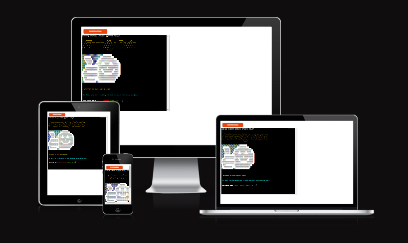
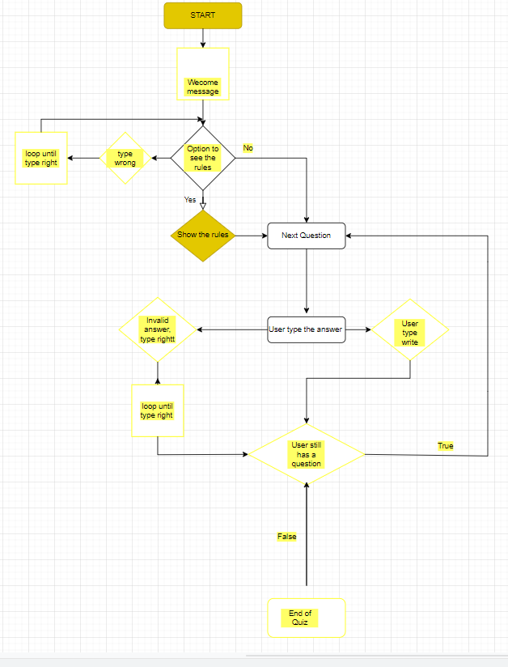
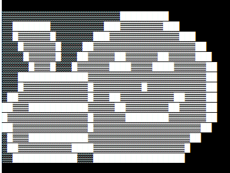
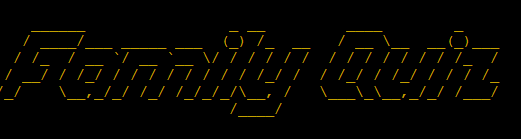
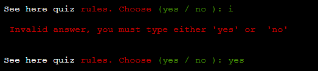
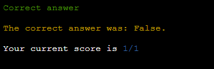
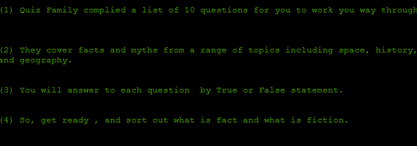
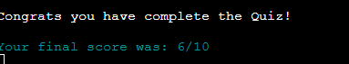

## Project 3

# Family Quiz

The Project is deployed [here]( https://family-quiz-pp3.herokuapp.com/)   
GitHub repository is [here](https://github.com/fitabigail/family-quiz) 

# Aim of the program

The Family Quiz is a web application of ten questions quiz game built on a Python terminal that runs in the  Code Institute terminal on Heroku.
The project was designed for the purpose of completing the Portfolio 3 Project for a Diploma in Software Development(E-commerce Applications)with the Code Institute.

# User stories

### First-time visitor

- I want to be able to open the quiz program
- I want to be able to check the rules of the Quiz
- I want to be able to skip the rules of the Quiz
- Once I pass the quiz rule I want to be  able to start the Quiz.
- I want to be able to see my score during the Quiz.
- I want to be able to see my final score at the end of the Quiz.

### The goals were accomplished in the following ways

- First-time visitor is given the option to see or skip the quiz rules.
- First-time visitors can play the Quiz. 
- Once start the Quiz the user can keep track of the score.
- After the quiz is completed the user can check his score on the terminal

### Returning visitor

- I would like to play again the quiz.

# Structure of the program

    The flow chart showing the logic of the program can be found here:

    The program is a command line program that leads the user through a series of questions and statements from start to end.

*  The program starts with a welcome message and asks them to choose if want to see the quiz rules
*  The user has the option to see the rules by typing 'yes' or to start the game by typing 'no'
*  If the user type other than the words 'yes' or 'no' will get a message with an Invalid answer
*  When the user starts the quiz he will be asked the answer to each question by typing True/False
*  After each question, the user can see if the answer is correct, and his score 
*  If the user is typing anything else than letters True/False will get a message of Invalid answer
*  When the user answered all the quiz questions he will get a message of Congratulation and his final score

# Feature

*  Used Object Oriented programming to create class Quiz as _init_, and class QuizBrain for the actions taken on quiz all called on run.py.
*  TITLE FamilyQuiz - gives a nice introduction to the quiz, and suggests the topic of the quiz. Pyfiglet library was called to display the Title. From pyfiglet imported figlet_format method to convert ASCII text into ASCII art fonts. Chosen font for the title was 'slant'.

*  IMAGE - [ASCII art](https://text-symbols.com/ascii-art/#all_cats) the emoji is shown when the program starts. This gives a nice introduction to the quiz with the image of an emoji wishing good luck to the player.

*  COLORAMA added a feature to allow different colors of fonts to display in the terminal. This feature aims to help the user understand what the program is doing or what is expected of the user. Since the command-line is not user-friendly, the user is not used to reading various lines to understand that there was an error returned. Once the error message is in red it stands out amongst other lines and allows the user to act on it.

Various colors are used to help the user better understand the requirements of the program:

* the ValidationErrors are displayed in red
* the positive validation messages are displayed in green
* the rules message are displayed in green
* the correct answer is displayed in yellow
* the title is displayed in yellow
* the score is displayed in blue

* Validation Various validation on user input allows the user to run the program without errors. Validation aims to capture various incorrect entries by the user and give feedback to the user. This way the user can give correct input and the program will give the user result. This also prevents the program from crashing. An example of an error validation message can be found below:

* The terminal of 80 characters wide and 24 rows high

## Possible futures:

I would like to add extra features to the program such as:

* Add a user name with age and email address
* Connect the program to a GSpread Sheet to collect all data from users like name, age, email, and score
* The final score is to be displayed together with data from a spreadsheet and to show the user score and the biggest score
* To send user results by email
* Add more quiz categories

# Styling

Styling in the terminal is very limited. The interaction with the user is by Validation errors or messages informing that input has passed validation. To make the terminal messages more intuitive Colorama colors were introduced. The error messages are in red and the positive validation messages are in green. Also, the emoji image was added as a welcome screen.

# Technologies used
- Code Institute template with HTML and CSS
- Python
- Libraries:
    * Colorama
    * Pyfiglet
    
## Validation
    

The code has been put through validation PEP8 validator added to Gitpod Workspace, as the pep8online.com is currently down. The PEP8 validator was installed to gitpod with the command pip3 install pycodestyle, and you can follow the next steps to install:

   * in your workspace, press Ctrl+Shift+P (or Cmd+Shift+P on Mac).
   * type the word linter into the search bar that appears, and click on Python
   * select Linter from the filtered results (image 1).
   * select pycodestyle from the list (image 2).
   * PEP8 errors will now be underlined in red, as well as listed in the PROBLEMS tab beside your terminal.

* run.py -  errors to lines 51, 54, 76 "errors defaults to 'strict'", line 77 "continuation line over-indented", 107 "line to long"
* brain.py - errors line 36 "errors defaults to 'strict'", and line 43 "line too long"
* Gramarly - Used [gramarly](https://app.grammarly.com) for spell check for README.md 

## Testing

| Feature|  Expectation | Action |  Result |
|--|--|--|-- |
| Rules input:    |
||
| YES | Prints quiz rules to the screen | Input yes or YES| Rules are printed to the screen  |
| NO | No rules are displayed,  message to start the quiz | Input no/NO | No rules are displayed, displayed message to start the quiz|
| Invalid | Invalid answer message is displayed and the user prompter to enter valid answer| input various characters other than yes YES no or NO | Invalid answer message is displayed and the user prompter to enter valid answer|
|| 
|--|--|--|-- |
| Questions input:    |
||
| TRUE | If the answer is TRUE message correct | Input true or TRUE| A correct answer message  is displayed if TRUE, if not TRUE incorrect answer is displayed and added to the score and displays the user score  |
| FALSE | If the answer is FALSE message correct | Input false/FALSE | A correct answer message is displayed if FALSE, if not FALSE incorrect answer displayed and added to score and display user score|
| Invalid | Invalid answer message is displayed and the user prompter to enter valid answer| input various characters other than yes TRUE or FALSE | Invalid answer message is displayed and the user prompter to enter valid answer|
|| 
|--|--|--|-- |
| Questions input:    |
||
| TRUE/FALSE | End of the quiz | Input TRUE or FALSE | A  message is displayed with congratulation and  displays the final  user e score  |
|| 

# Bugs

* the questions answer was not taken in the lower case of False and True, I have fixed it with lower() and a list of[ true, false]
* indentations cause me some errors which have fixed deleting the spaces at the beginning of a code line.
* the code for the title was not displayed properly to Heroku , so I have fixed the issue by changing the code syntax.
* on deployment, the program was not fit to the window I have fixed the issue by changing the display size to 100cols with 40rows.

# Remaining bugs:
* no bugs remain that I am aware of.

# Deployment

The site was deployed to Heroku. Please follow the below steps.

Deployment steps

### Deployment steps

1. add the list of requirements by writing in the terminal "pip3 freeze > requirements.txt"
2. Git add and git commit the changes made
3. Log into [Heroku](https://dashboard.heroku.com/apps) or create a new account and log in

4. top right-hand corner click "New" and choose the option Create new app if you are a new user, the "Create new app" button will appear in the middle of the screen
5. Write the app name - it has to be unique, it cannot be the same as this app
6. Choose Region - I am in Europe
7. Click "Create App"

The page of your project opens.
8. Choose "settings" from the menu at the top of the page
9. Go to section "Config Vars" and click the button "Reveal Config Vars"
10. Add another key "PORT" and value "8000"

11. Go to the section "Build packs" and click "Add build pack"
    - in this new window - click Python and "Save changes"
    - click "Add build pack" again
    - in this new window - click Node.js and "Save changes"
    - take care to have those apps in this order: Python first, Node.js second, drag and drop if needed

12. Next go at "Deploy" in the menu bar on the top 
13. Go to the section "deployment method", and choose "GitHub"
14. New section will appear "Connect to GitHub" - Search for the repository to connect to
15. type the name of your repository and click "search"
16. once Heroku finds your repository - click "connect"

17. Scroll down to the section "Automatic Deploys"
18. Click "Enable automatic deploys" or choose "Deploy branch" and manually deploy
19. Click "Deploy branch"

Once the program runs you should see the message "the app was succesfully deployed"
20. Click the button "View"

Forking the GitHub repository

### Forking the GitHub repository
By forking out of this repository you will be able to view and edit the code without affecting the original repository. 

1. Locate the GitHub repository. The link can be found [here](https://github.com/fitabigail/family-quiz).
2. Click the button in the top right-hand corner "Fork"
3. This will take you to your own repository to a fork that is called the same as the original branch. 

### Making a local clone

1. Locate the GitHub repository. The link can be found [here](https://github.com/fitabigail/family-quiz).
2. Next to the green Gitpod button you will see a button "code" with an arrow pointing down
3. You are given the option to open with GitHub desktop or download a zip
4. You can also copy HTTPS full link, go to git bash and write git clone and paste the full link

# Credits

### Code/Reference 

I have followed one main tutorial and I work hard to understand  Object Oriented Programming and adapt as much as possible to my quiz different.

- Code Institute without I would have had no base to begin a project & Readme.md Template. For this template, I have changed the size of the screen display for easy reading.
    https://codeinstitute.net/ie/
- GitHub for my workspace and saving all my work as well as my deployed project. https://github.com/ ;  
- The Slack community - for someone always been there no matter the time and with advice or direction. https://slack.com';
-  Open Trivia DB API- for quiz questions format. https://opentdb.com/api_config.php
- https://smartmortgages.ie/ - inspired me for building the site and get the content from them;
- https://www.udemy.com/course/100-days-of-code/learn/lecture/19964920#overview - Udemy course help me to develop this project;
- https://www.udemy.com/course/complete-python-bootcamp/learn/lecture/9478306?start=120#overview - Udemy course helps me to understand Object-oriented programming in python; 
- https://www.w3schools.com/ - guide me with Python class and method;

### Images
- emoji image - ASCII Art from https://text-symbols.com/ascii-art/#all_cats

### Note 
 - I'd like to thank my mentor Ronan McClelland for his guidance throughout my project. 
 - I would like to thank everyone for all and any assistance given during the development of my website. 
 - All information within this website is for education and training purposes only.
 - All code has been as much as possible credited to the source that the code came from.
